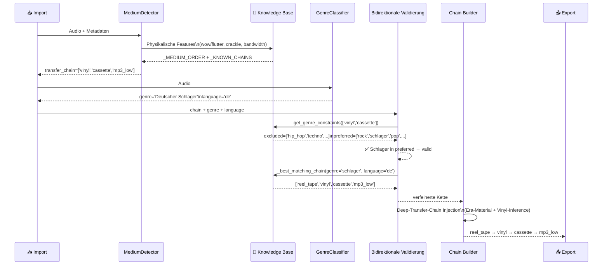
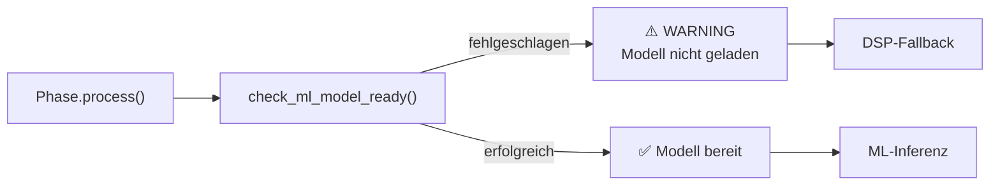
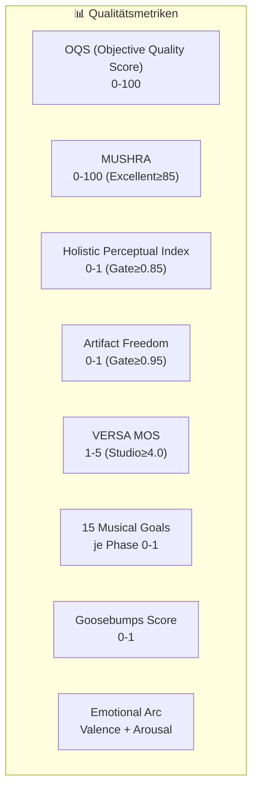
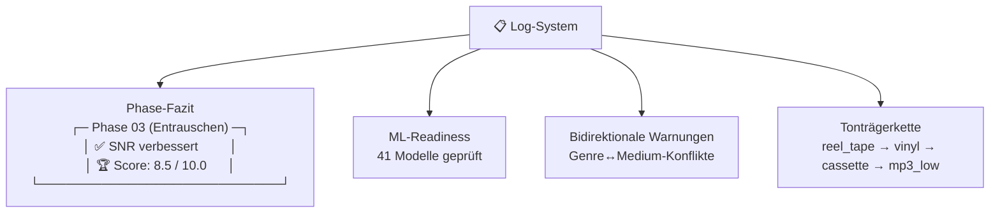

# Aurik 10 — Vollständige Systemarchitektur

## Import → Pre-Analysis → Restauration → Export

```mermaid
flowchart TD
    subgraph IMPORT["📥 Import"]
        FILE["Audio-Datei\n(.mp3/.wav/.flac/.aac)"]
        META["Metadaten\n(ID3, Dateiname)"]
    end

    subgraph PRE["🔍 Pre-Analysis (pre_analysis.py)"]
        direction TB
        MD["MediumDetector\n20 Tonträger · 76 Ketten\n195 Genres · 7 Sprachen"]
        EC["EraClassifier\nJahrzehnt · Material-Prior"]
        GC["GenreClassifier\nGermanSchlagerClassifier\n6 DSP-Tiers + CLAP"]
        DS["DefectScanner\n54 Defekttypen"]
        RE["RestorabilityEstimator\n0-100 Score"]
        BV{"Bidirektionale\nValidierung"}
        CHAIN["Deep-Transfer-Chain\nInjection + Refinement"]
    end

    subgraph KNOWLEDGE["🧠 Knowledge Base (medium_detector.py)"]
        KB1["_MEDIUM_ORDER\n20 Tonträger chronologisch"]
        KB2["_KNOWN_CHAINS\n76 Transfer-Ketten"]
        KB3["_GENRE_EARLIEST_ORDER\n195 Genres × 14 Ären"]
        KB4["_MEDIUM_EXCLUDES_GENRES\n8 Medien × Ausschlüsse"]
        KB5["_MEDIUM_PREFERRED_GENRES\n13 Medien × Präferenzen"]
        KB6["_LANGUAGE_MEDIUM_BONUS\n7 Sprachen × Medium-Boni"]
        KB7["_STUDIO_FORMAT_INDICATORS\n21 Studio-Charakteristiken"]
    end

    subgraph DENKER["🤖 Denker-Schicht"]
        AD["AurikDenker\nOrchestrierung"]
        DD["DefektDenker\nDefekt-Strategie"]
        RD["ReparaturDenker\nChirurgie-Plan"]
        ReD["RekonstruktionsDenker\nLücken-Schließung"]
        ED["ExzellenzDenker\nQualitäts-Maximierung"]
        CROSS["CrossPhaseCoordinator\nPhasen-Kohärenz"]
    end

    subgraph PHASES["⚙️ 66 Verarbeitungsphasen"]
        direction LR
        P01["01 Click Removal"]
        P02["02 Hum Removal"]
        P03["03 Denoise\n(DeepFilterNet+BS-RoFormer)"]
        P09["09 Crackle\n(BANQUET ONNX)"]
        P12["12 Wow/Flutter\n(BasicPitch)"]
        P18["18 Noise Gate\n(Silero VAD)"]
        P23["23 Spectral Repair\n(AudioSR)"]
        P24["24 Dropout Repair\n(GACELA+AudioLDM2)"]
        P42["42 Vocal Enhancement\n(Demucs+BS-RoFormer)"]
        P66["66 Stem NR"]
        MORE["... 56 weitere Phasen"]
    end

    subgraph MODELS["🧩 41 ML-Modelle (ml_model_readiness.py)"]
        ML1["DeepFilterNetV3 · BANQUET · AudioSR"]
        ML2["BS-RoFormer · MIIPHER · Demucs"]
        ML3["GACELA · AudioLDM2 · DiffWave"]
        ML4["FCPE · CREPE · BasicPitch · RMVPE"]
        ML5["PANNs · LAION-CLAP · BEATs · MERT"]
        ML6["Whisper · Wav2Vec2 · Resemblyzer"]
        ML7["SileroVAD · SGMSE+ · ConvTasNet"]
    end

    subgraph GUARDS["🛡️ Quality Gates"]
        PMGG["Per-Phase Musical Goals Gate\n15 Ziele pro Phase"]
        AFG["Artifact Freedom Gate\n5 Artefakt-Typen"]
        HPG["Holistic Perceptual Gate\nHPI 0-1 Score"]
        SFT["Signal Flow Tracer\nPhase-übergreifend"]
        MEM["Memory Budget Guard\nAdaptiv 8-12% oomd"]
        CLIP["ClippingDetector\nHard/Soft-Saturation"]
    end

    subgraph EXPORT["📤 Export"]
        MQA["Musical Quality Assurance\nVERSA · MUSHRA · OQS"]
        HHC["Human Hearing Comfort Guard"]
        LUFS["LUFS Normalization"]
        EXPFILE["Ausgabe-Datei\n(.wav/.flac/.mp3)"]
    end

    FILE --> PRE
    META --> EC
    MD --> KB1 & KB2 & KB3 & KB4 & KB5 & KB6 & KB7
    KB1 & KB2 & KB3 & KB4 & KB5 & KB6 & KB7 --> MD
    MD --> BV
    EC --> CHAIN
    GC --> BV
    BV --> CHAIN
    DS --> CHAIN
    RE --> CHAIN
    CHAIN --> AD
    AD --> DD & RD & ReD
    DD & RD & ReD --> ED
    ED --> CROSS
    CROSS --> PHASES
    P01 & P02 & P03 & P09 & P12 & P18 & P23 & P24 & P42 & P66 --> MORE
    PHASES --> PMGG & AFG & HPG
    PMGG & AFG & HPG --> ED
    SFT --> ED
    MEM --> MODELS
    MODELS --> PHASES
    PHASES --> MQA
    MQA --> HHC --> LUFS --> EXPFILE
    CLIP --> P23
```

## Wissensfluss: Bidirektionale Genre↔Medium-Validierung

## ML-Modell-Readiness-Check: Pre-Flight pro Phase

## Score- und Qualitätsmetriken

## Speicher und Log-Struktur

