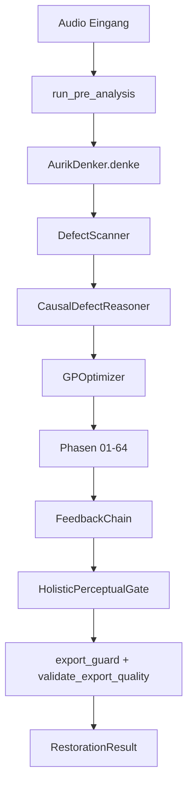

# Aurik 9.x.x - Architektur-Ueberblick

**Stand:** Mai 2026  
**Version:** 9.12.8  
**Status:** RELEASE_MUST-konform

Verbindlicher Wahrheitsstand: `.github/specs/01-08` und `docs/CHANGELOG_HISTORY.md`.

## Kernzahlen (aktuell)

- 64 Phasen (01-64)
- 54 DetectionTypes (DefectScanner)
- 62 Kausal-Ursachen (CausalDefectReasoner)
- 14 Musical Goals

## Kanonischer Release-Vertrag

```text
Audio-Import  -> backend.api.bridge.get_load_audio_fn()
Voranalyse    -> backend.api.bridge.run_pre_analysis() genau einmal
Pipeline      -> get_aurik_denker_instance().denke(...)
Modus         -> restoration | studio2026
Export        -> export_guard() + validate_export_quality() + AudioExporter
```

## Zentrale Komponenten

| Komponente | Zweck |
| --- | --- |
| `AurikDenker` | Kognitive Orchestrierung der Gesamtpipeline |
| `UnifiedRestorerV3` | Phase-Orchestrierung und Kontextsteuerung |
| `DefectScanner` | Defekt-Detektion (54 Typen) |
| `CausalDefectReasoner` | Kausalkette und Mapping auf Phasen (62 Ursachen) |
| `GPOptimizer` | Adaptive Staerke-/Parameteroptimierung |
| `MusicalGoalsChecker` | 14-goal Bewertung |
| `HolisticPerceptualGate` | HPI/AFG/VQI-basierte Freigabelogik |

## Datenfluss (vereinfacht)



## Qualitäts- und Sicherheitsinvarianten

- `artifact_freedom < 0.95` blockiert Freigabe.
- Vokalpfad nutzt VQI als zusaetzlichen Recovery-Trigger.
- Kein paralleler Produktpfad ausserhalb des kanonischen Vertrags.

## Produktgrenzen

- Desktop-only
- Offline-first
- Mono/Stereo als produktiver Zielpfad
- Keine Cloud-/Serverpflicht im Endnutzerbetrieb
